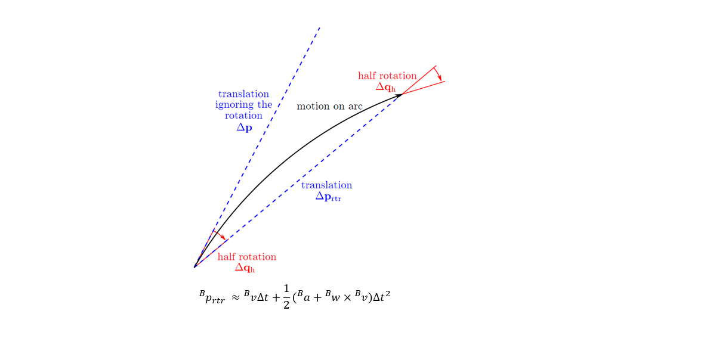

## Computing Motion Derivatives from 6DoF Noisy Pose Measurements

Generating ground truth 6DoF pose, velocity and acceleration data is crucial to verify many algorithms in robotics. This repository implements [1] with some modification to estimate translational and angular velocity and acceleration from a given sequence of pose measurements.
The rotation is represented as a unit quaternion. The implementation assumes constant rotational and translational acceleration in body coordinates.
The estimation of translational and rotational derivatives are decoupled, and the motion curve is approximated as a three step motion: half rotation, translation and half rotation as shown below.

**Pseudocode:**
The pseudocode is provided below.𝑀𝑜𝑡𝑖𝑜𝑛𝑅𝑒𝑔𝑟𝑒𝑠𝑠𝑖𝑜𝑛6𝐷 implementation is identical to [1]. 

There are ambiguities with the quaternion notation in [1], which inherits the notation from one of its references. The implementation of 𝑆𝑝𝑎𝑡𝑖𝑎𝑙𝑅𝑜𝑡𝑎𝑡𝑖𝑜𝑛𝐷𝑒𝑟𝑖𝑣𝑎𝑡𝑖𝑣𝑒𝑠 and 𝐵𝑜𝑑𝑦𝐷𝑒𝑟𝑖𝑣𝑎𝑡𝑖𝑣𝑒𝑠 follows the notation below.
Additionally, I included an option to preprocess the pose measurements. If you set PREPROCESSING=True, the position and quaternion measurements are averaged over a sliding window. The implementation of quaternion averaging is described here[2].
For smoothing position, it's better to use [this](https://docs.scipy.org/doc/scipy-0.16.1/reference/generated/scipy.signal.savgol_filter.html) to get a smooth interpolation.

**Notes:**
A substantial amount of papers have ambigious rotation/attitude representations especially when using quaternions. A rotation operation can be active and rotate a vector or be passive and rotate only point of view via frame transformation. The equations can differ depending on order of cpmponents and right/left handedness of the coordinate systems.
I recommend reading [3].

**Files:**
* /code/test_data.mat : Test data containing quaternion and position measurements
* /Vel_Acc_Estimation_from_Pose.py :  standalone main python script 

**References:** 
_[1]_ Sittel, Florian, Joerg Mueller, and Wolfram Burgard.Computing velocities and accelerations from a pose time sequence in three-dimensional space. Technical Report 272, University of Freiburg, Department of Computer Science, 2013.

_[2]_  Markley, F. Landis, et al. "Averaging quaternions." Journal of Guidance, Control, and Dynamics 30.4 (2007): 1193-1197.

_[3]_ Sola, Joan. "Quaternion kinematics for the error-state Kalman filter." arXiv preprint arXiv:1711.02508 (2017).

